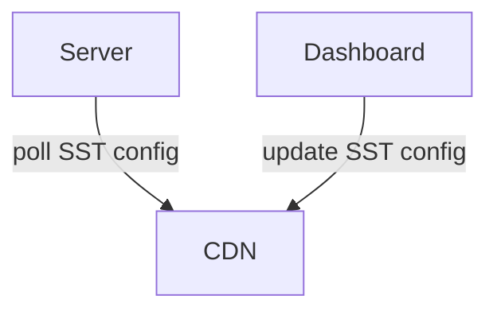

Symplify Server-Side Testing SDK
================================

https://symplify.com

For server-side testing, we provide SDKs for different platforms to be used in
your backend (web) servers to integrate A/B testing.

The server-side tests don't contain any customization code, only projects and
variations with IDs, names, and weights.

Architecture Overview
=====================



The SDK when initialized in your server keeps a small config in memory for the
active server-side tests on your website. You manage the tests in our dashboard,
and updates are published to our CDN.

The SDK periodically checks to ensure it has the current version of the config.

For each code path where you want to test different variations per visitor, you
need to ask the SDK for the variation allocation.

See the docs for each platform SDK for API specifics.

Visitor Allocation
==================

There is no need for any per-visitor storage, the allocation is idempotent.

It does depend on the variation weights in each project though, and distinct
visitor IDs. When you are running a test, know that adding or removing
variations or changing weights may change the variation a give visitor is
assigned. To ensure you don't have to keep track of visitor IDs in your code or
persistence, we integrate with HTTP cookies.

This is how we allocate a visitor ID:

1. Look at `sg_sst_vid` cookie, if it has a value: that is the visitor ID, and we are done.
2. If we didn't find an ID in our cookie, generate a new one and send it in the response cookie.

Variation Allocation
====================

The SDK will read cookies and use already persisted variation if there is one, 
otherwise allocate a new variation.

This is how we allocate a variation within a visitor, for a given project:

1. If the project does not exist, return null
2. Iterate over all variations in the project:
   1. assign each variation a weight window from the current total weight to the same plus the variation weight
3. Use a "windowed" hash function to hash the string key "$visitor_id:$project_id" within the total weight of all variations
4. Get the variation assigned the window that matches the result form the hashing

### Cookies
To ensure visitors get the same variation consistently, the SDK will store the allocated variation in a cookie called `sg_cookies`. 
The SDK read cookies through `Cookie` request header and write cookies through `Set-Cookie` response header. 
Same cookie is read by the frontend js-sdk script. It starts follow user actions to track goals when sst-sdk variation allocation 
is detected.

See the docs for each platform for examples on how to set up this functionality.

#### Ensure following setup is implemented:

1. Use your top domain as cookie domain

If you run test on a site with multiple subdomains, you will need to use a common "parent" domain for the cookies, 
such as ".example.com" for e.g. "b2b.example.com" and "store.example.com". Otherwise, you will get multiple `sg_cookies` 
and the sync between the sst-sdk and frontend js-sdk might be disturbed.

2. Allow credentials being sent and set by browser

In your response, the header `Access-Control-Allow-Credentials: true` needs to be set.
For CORS requests, credentials mode also needs to be set in your client, 
by `withCredentials: true` if using XHR request, or `credentials: include` if using Fetch.


#### Troubleshooting

- I get a variation rendered, but it changes on next reload.

The variation allocation might not be not persisted in cookie storage, or not sent correctly in headers.

To verify variation allocation has been persisted, `sg_cookies` should contain at least these three properties 
within the object of your websiteID:

```
'websiteID': { 
   'projectID': [variationID],
   'projectID_ch: 1,
   'aud_p': [projectID]
   }
```

If these properties are missing, verify `sg_cookies` are sent in `Set-Cookie` response header. 
Without it, the given variation will not be set in cookie storage by the browser.

If the properties are present, verify `sg_cookies` are sent in the `Cookie` request header.
Without it, the SDK will never know of previous variation allocations, and allocate a new variation on every request.

Ensure credentials are allowed according to instructions in this doc.

- I want to allocate multiple projects on same request, but only one of the projects get a variation allocated

Make sure you put the cookie information from each allocation into the same Set-Cookie header. 
If multiple Set-Cookie headers of same cookie name are sent in the response, 
only one will be persisted in cookie storage.
